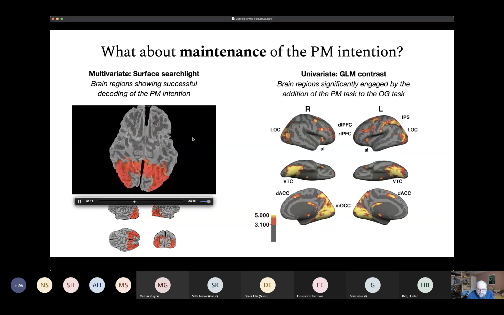

# International Prospective Memory Seminar
If you've made it to this page, there's a good chance that you have some interest in prospective memory. If that's the case, you'll definitely be interested in the [International Prospective Memory Seminar](https://utaamalab.wordpress.com/international-prospective-memory-seminar/) that has been going on from 2020-2021.

[Dr. Hunter Ball](https://utaamalab.wordpress.com/faculty/), an Assistant Professor at the University of Texas at Arlington has organized a really amazing bi-weekly meeting for researchers from all over to discuss all aspects of PM research. There have been some fantastic conversations at these meetings, which are attended by many of the world's experts in the field. Dr. Ball has made these meetings open to anyone interested, and as of posting this, there is still time to join in for the last two of the Spring (see the link above).

I was fortunate enough to have my PhD work highlighted during a talk led by my graduate mentor, Jarrod, at a recent meeting. The discussion has been uploaded to YT, so I figured I'd add a link here in case anyone was interested in seeing more about what we've been working on. To find that video, click on the image below:

